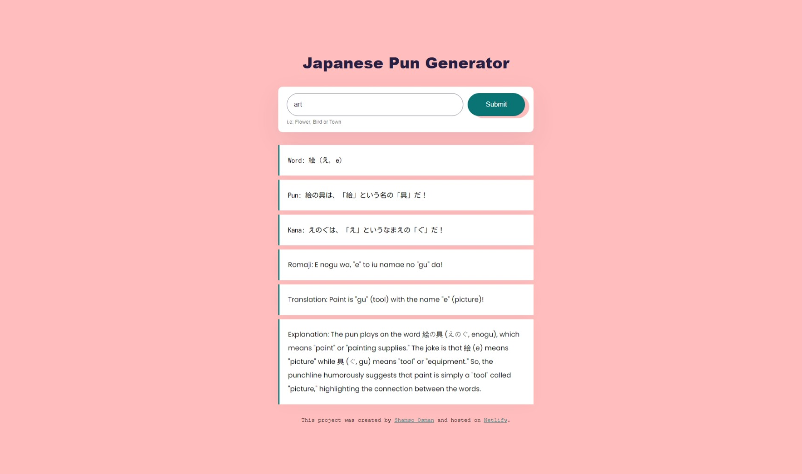

# Japanese Pun Generator

Welcome to the **Japanese Pun Generator**! This web application is a playful tool designed to create witty Japanese puns (dajare) based on user-provided topics. It showcases the charm of Japanese wordplay by incorporating homophones, kanji nuances, and cultural references.

## Features

- **Interactive Input**: Enter a topic, such as "flower," "bird," or "town," to generate a Japanese pun.
- **Detailed Output**: Each pun includes:
  - The original Japanese word
  - The pun itself
  - Kana and romaji
  - English translation
  - A brief explanation of the pun
- **Typewriter Effect**: Animates the display of each part of the pun for a delightful user experience.
- **Clean and Minimal UI**: Simple and responsive design for easy interaction.

## Live Demo

Experience the generator live on [Netlify](https://ai-project-shecodes.netlify.app/). No setup required—just visit the link and have fun exploring Japanese wordplay!

## Technology Stack

- **HTML**: For the structure of the application.
- **CSS**: For styling and responsive design.
- **JavaScript**: For interactive functionality and API integration.
- **Axios**: For making API requests.
- **Typewriter Effect**: For animating text display.
- **Netlify**: For deployment.

## Author

Created by [Shamso Osman](https://www.linkedin.com/in/shamso-osman). Hosted on [Netlify](https://ai-pun-generator.netlify.app/).

