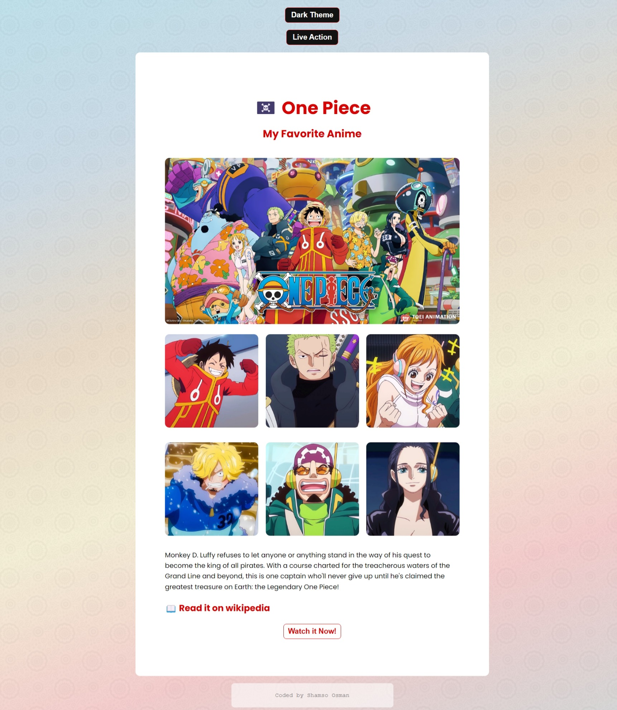
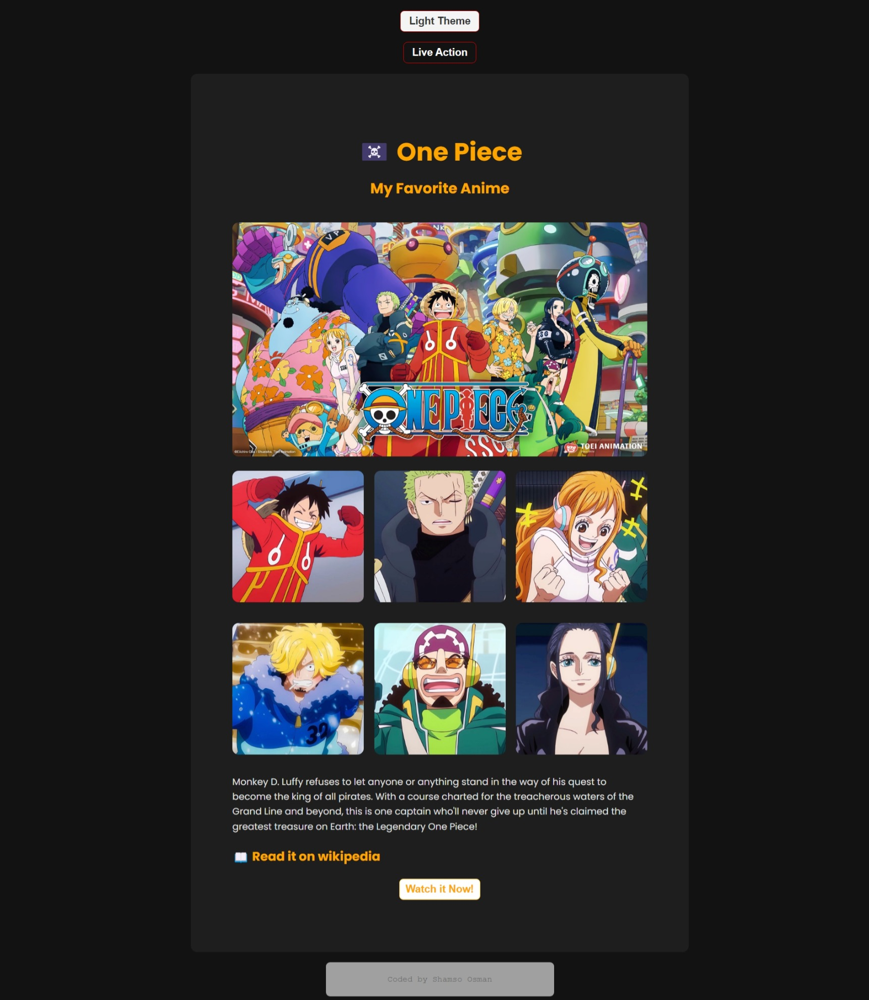
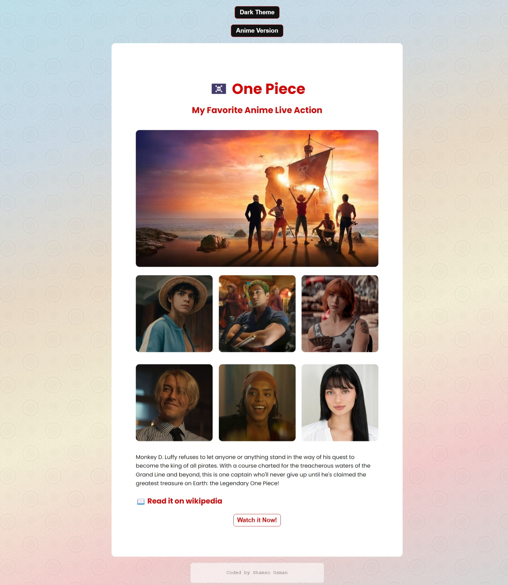
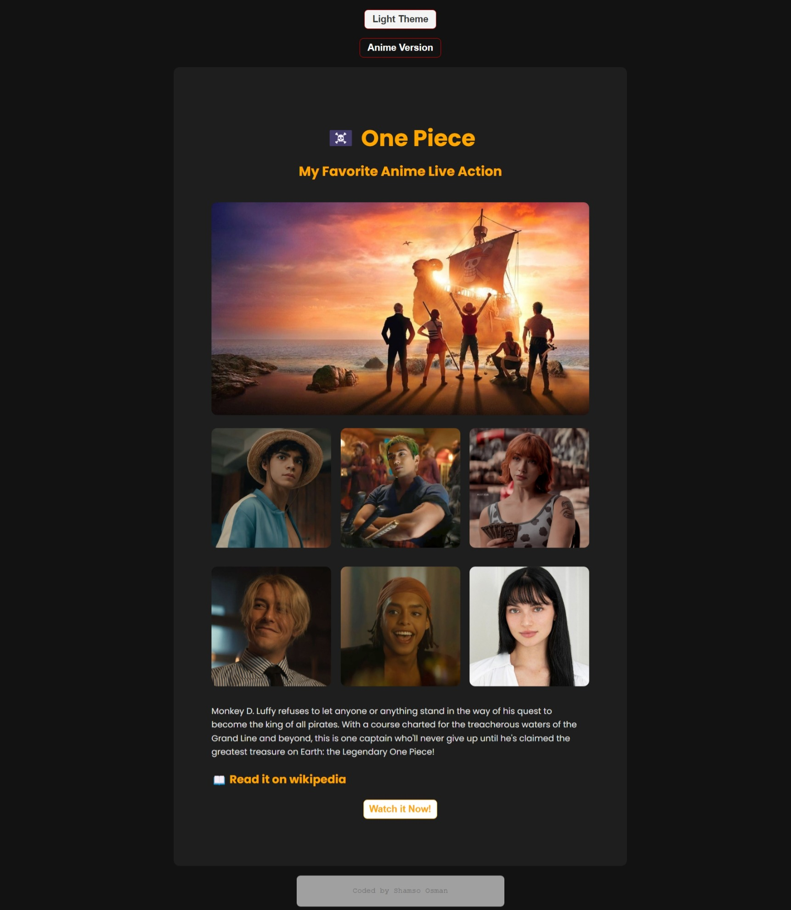

# SheCodes Basics AddOn

## Overview

The SheCodes Basics AddOn is a web project that adds interactivity and theme-switching capabilities to a fan page dedicated to the anime *One Piece*. This project allows users to switch between a light and dark theme and toggle between an anime version and its live-action adaptation. It utilizes HTML, CSS, and JavaScript to provide a dynamic and engaging experience.

## Features

- **Theme Toggle**: Switch between light and dark themes with a button.
- **Live Action Toggle**: Switch between the anime and its live-action adaptation with updated content and images.
- **Responsive Design**: Ensures the page looks great on various devices.
- **Dynamic Content**: Uses JavaScript to update the content based on user interactions.

## Technologies Used

- **HTML**: Structure of the webpage.
- **CSS**: Styling of the webpage, including themes and transitions.
- **JavaScript**: Handles theme switching and content updates.

## Getting Started

To view and interact with the SheCodes Basics AddOn project, follow these steps:

## How to Use

1. **Theme Toggle**:
   - Click the "Dark Theme" button to switch to dark mode.
   - Click the button again to switch back to light mode.

2. **Live Action Toggle**:
   - Click the "Live Action" button to switch to the live-action adaptation.
   - Click the button again to revert to the anime version.

## Screenshots And Demo
[Link to deployment](https://s3.amazonaws.com/shecodesio-production/challenge_submissions/files/002/367/709/original/Final_Basics_Addons.html?1726162443)
1. Anime Version

  
  

2. Live Action Version

  
  

## Credits
**Images**: Sourced from Pinterest. All rights reserved to the original artists.

## License

This project is licensed under the MIT License - see the [LICENSE](LICENSE) file for details.

---

